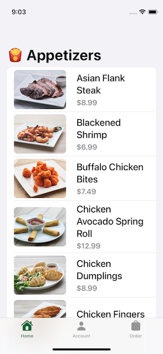
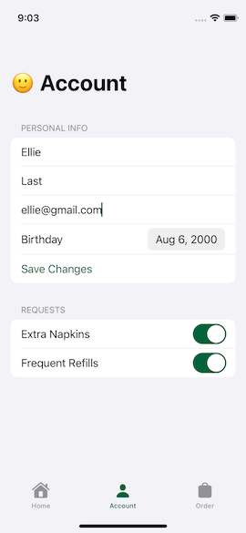
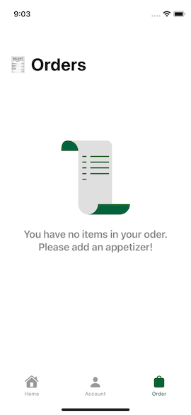

# 🍽️ Appetizers App

A SwiftUI-based iOS application that allows users to browse a list of appetizers, place orders, and manage personal account settings. The app is built using the MVVM architectural pattern with clean, modular code and robust error handling.

## 📋 Table of Contents

- [Features](#features)
- [Screenshots](#screenshots)
- [Architecture](#architecture)
- [Technologies](#technologies)
- [Error Handling](#error-handling)
- [Installation](#installation)
- [License](#license)

## ✅ Features

- 🏠 **Home View (Appetizers List)**  
  Browse a dynamic list of appetizers fetched from a server. Tap an appetizer to view its details and add it to your order.

- 🧾 **Order View**  
  View your current order with:
  - Swipe-to-delete individual items
  - Trash icon to clear the entire order

- 👤 **Account View**  
  Store and update personal data:
  - Name
  - Age
  - Email (validated)
  - Preferences: Extra Napkins & Extra Refills (toggle buttons)

- ⚠️ **Error Handling**  
  - Alert dialogs for server errors
  - Input validation alerts (e.g., invalid email)

## 📸 Screenshots
> 
> 
> 


## 🧠 Architecture

The app is structured using the **Model-View-ViewModel (MVVM)** design pattern to promote clean separation of concerns and scalability:

- **Model**: Data structures representing appetizers, user details, and preferences.
- **ViewModel**: Business logic, data formatting, and network handling.
- **View**: SwiftUI views that reactively update based on state.

## 🛠 Technologies

- SwiftUI
- Combine
- MVVM Architecture
- URLSession for networking
- Codable for JSON parsing

## 🧯 Error Handling

Robust error handling includes:
- Graceful fallback with user alerts on network/server failures
- Input validation with real-time user feedback
- Defensive programming practices for safe user interactions

## 🚀 Installation

1. Clone the repository:
   ```bash
   git clone https://github.com/yourusername/AppetizersApp.git
2. Open the .xcodeproj or .xcodeworkspace file in Xcode.

3. Build and run on a simulator or physical device.

Requires Xcode 14+ and iOS 15.0+

## 📄 License
This project is open-source and available under the MIT License.
